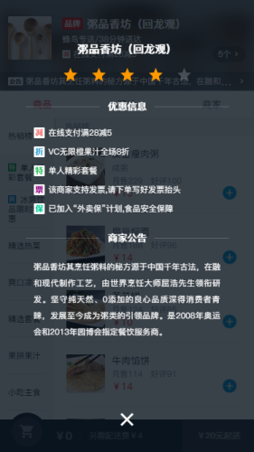
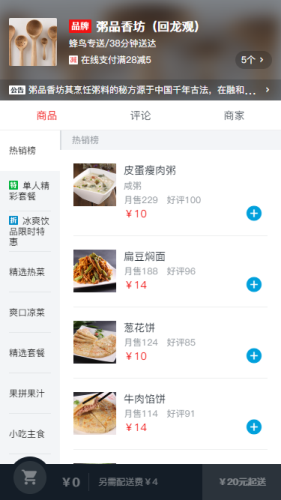
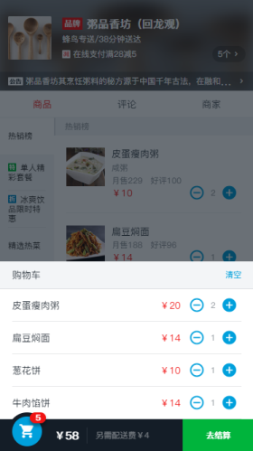
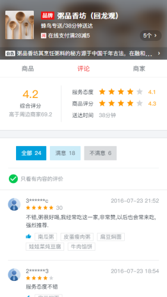
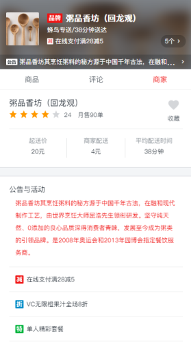

# vue-sell

## 1. 项目描述

本项目是一款仿饿了么的WebApp。主要分为商家介绍、商品展示、商品详情、商家评论、商家简介等。

本项目使用 vue + vue-cli 3.0 构建的单页面应用，项目采用了vue-route、axios 以及 ES6语法，使用模拟数据（mock），采用组件化思想搭建整个项目，从而使组件高度复用。

## 2. 如何运行

+ 克隆代码：`https://gitee.com/VueToLRH/vue-sell.git`
+ 安装依赖：`npm install`
+ 运行：`npm run serve`
+ 打包：`npm run build`
+ ESlint检查：`npm run lint`

## 3. 项目展示

     
