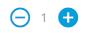
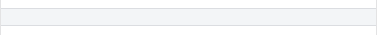
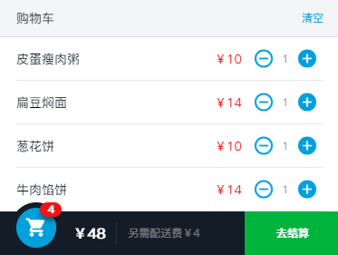
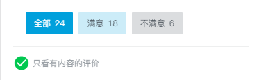

# 项目组件简介

## 1. cartcontrol



cartcontrol组件 props 接受数据参数：

+ food：Object，单个商品信息

cartcontrol组件 $emit 触发事件：

+ add：商品数量 +1 操作。携带参数为：当前增加商品数量按钮DOM (event.target), 主要用于小球动画，通过 getBoundingClientRect 获取增加商品数量按钮DOM相对视口的位置

## 2. star


star组件 props 接受数据参数：

+ size：Number，star尺寸。可选值为：24、36、48
+ score：Number，评分

star组件 通过接受的数据参数绑定 class 完成评分星级的渲染。size（尺寸）与评分计算（score计算）组成对应 class。

+ size参数 对应绑定 class 为 `star-xx`
+ score参数 对应绑定 class 为 `.on` `.half` `.off`

``` html
  <!-- 评分为 3.3 的 DOM 以及其 class 组成 -->
  <div class="star star-24">
    <span class="star-item on"></span>
    <span class="star-item on"></span>
    <span class="star-item half"></span>
    <span class="star-item off"></span>
    <span class="star-item off"></span>
  </div>
```

star组件 - score评分计算

+ 将评分转换为数组形式，示例：评分为3.3分，转换为数组形式为: ['CLS_ON', 'CLS_ON', 'CLS_ON', 'CLS_HALF', 'CLS_OFF', 'CLS_OFF']
  + CLS_ON 对应 class 为 `.on`
  + CLS_HALF 对应 class 为 `.half`
  + CLS_OFF 对应 class 为 `.off`
+ 然后通过 v-for 循环数组，进行渲染

## 3. split（用于分隔）



## 4. shopcart



shopcart组件 props 接受数据参数：

+ selectFoods：Array，所选择的商品的信息数组
+ deliveryPrice：Number，配送费
+ minPrice：Number，起送价

## 5. ratingselect



ratingselect组件 props 接受数据参数：

+ ratings：Array，评论信息数组，主要通过过滤计算各类型评价的数量
+ selectType：Number，选择的评价类型，当前所选择的的评价类型，主要用于绑定的 class 高亮选中的评价类型
+ onlyContent：Boolean，是否只看有内容的评价
+ desc：Object，评价类型描述

ratingselect组件 $emit 触发事件：

+ select：选中的评价类型，携带参数 type 为评价类型
+ toggle：选择只看有内容评价事件触发